# Install guide
Cloner le git.
## Application

* [VS Code flutter](https://www.youtube.com/watch?v=sfA3NWDBPZ4&list=PL4cUxeGkcC9j--TKIdkb3ISfRbJeJYQwC)   
* [Install Flutter](https://flutter.dev/docs/get-started/install)

## Firestore

* [Firebase](https://www.youtube.com/watch?v=Wa0rdbb53I8&list=PL4cUxeGkcC9j--TKIdkb3ISfRbJeJYQwC&index=2)

Sur l'adresse suivant, se connecter à son compte google : [Firebase](https://console.firebase.google.com/u/0/)

Creer un project, saisir le nom du projet.

Desactiver google analytics. Creer le projet.

### Ajouter une application android
* Android package name :  **com.knowledge_checker_app**
* App nickname : n'importe quoi
* Télécharger le fichier JSON et le placer dans le dossier android/app/

### Authentification 
* Cliquer sur l'onglet Authentification
* Cliquer sur commencer
* Ensuite sur Adresse e-mail/mdp
* Activer
* Enregistrer

### Firestore
* Cliquer sur l'onglet Cloud Firesotre
* Créer une base de données
* Démarrer en mode test
* Selectionner un serveur en Europe West 
  
### classes
***La typo est très importante*** :
* Créer une collection nommée **classes**
* Créer un document **M1 INFO** pour id
* avec comme champ :
  - title (String) = M1 INFO
  - number (number) = 0
  - waiting (array) = Tableau vide (petit supprimer à coté du champ pour remplir) 
* Au sein de cette collection, il faut créer une sous-collection **sections** avec pour id **sections**
* Il faut créer un document pour cette section
  - id = Java
  - title (String) = Java
  - description (String) = Apprendre Java pour les nuls
  - dans ce document, il faut créer une sous-collection **skills** avec pour id **skills**
    - il faut créer un document pour id **Objet** avec pour champ
      - title (string) = Objet
      - description (string) = Instancier un objet de type String

Le setup est fini.
# Fonctionnalité
* Inscription/Connexion : Teacher ou Student
* Listing des classes inscrites
* Déconnexion
* 

## Student
* Validation de skill d'une section avec preuve écrite
* Listing des sections de la classe dynamique

## Teacher
* Listing des étudiants inscrit dans une classe
* Ajout d'une section pour la classe
* Ajout de skill dans une section
* Validation de la requête de l'étudiant

# Architecture
Lors du premier lancement de l'application, l'utilisateur arrive sur la page de connexion, où il peut accéder à la page de l'inscription.
Une fois son compte créé, il peut accéder aux différentes fonctionnalités en fonction de son rôle.
# Technologies
Nous avons codé l'application en Flutter, qui est un framework en dart.
En base de donnée, nous avons utilisé Firebase, qui s'intègre facilement en Flutter. Base de donnée NoSql, qui s'impose pour une appli mobile étant donnée la quantité d'information à stocker et un nombre d'utilisateur important.
Un peu de mal avec Flutter que nous avons dû apprendre, ainsi que la connexion avec la base de donnée et les requêtes asynchrones à effectuer dessus.
Nous avions pensé à faire une API REST en Node/PHP/Laravel avec une base de donnée relationnel, mais nous avons rencontrée quelques difficultés sur la mise en place du serveur et des requêtes, nous nous sommes tournés vers Firebase.
# Améliorations 
Nous avons imaginé quelques points pour améliorer l'application. Nous les avons découpé en plusieurs catégories (certains points se retrouvent dans plusieurs catégories) :

## Changements visuels
* (Partie étudiant) Changer la couleur d'un skill en fonction de son état 

***Rien*** 

***Envoyé à validation*** 

***Validé*** 

***Refusé*** 

* Ajouter une indication pour montrer à l'utilisateur qu'il à rentré le mauvais mot de passe / username
* Ajouter un petit icon pour indiquer que l'utilisateur n'est pas connecté à internet et qu'il ne pourra donc pas demander / recevoir de nouvelles données
* Changer la taille des widgets en fonction de la taille de l'écran de l'utilisateur car pour le moment l'application à été testée sur un écran ayant cette résolution : **1080 x 2340 pixels, 19.5:9 ratio (~409 ppi density)** (Xiaomi redmi note 7 par exemple)
* Changer l'îcone générique mise pour les sections par les badges obtenus par l'étudiant ou par une images définie lors de la création d'une section
* Ajout d'un écran de chargement lors de la connection pour montrer à l'utilisateur que des données sont en train d'être récupérés

## Nouvelles fonctionnalités
* Possibilité pour les professeurs de sélectionner juste un cours à superviser au lieu d'une classe
* Possibilitées de récupérer son mot de passe par mail si oublié
* Possibilité de voir le profil de ses étudiants (si professeur) ou de voir le profil des autres étudiants (si étudiant)
* (Partie étudiant) Possibilité de voir l'avancement moyen des autres étudiant de la promo
* Possibilité pour l'étudiant de rajouter une image, une photo ou un fichier lors de l'auto validation d'un skill
* Possibilité pour un professeur de sélectionner que certains professeur apte à valider une section lors de la création de celle-ci

* Possibilité pour le prof de créer une nouvelle promo/classe et d'y ajouter des élèves.

## Implémentation de fonctionnalitées pour des visuels déjà présents
* Dans les pages de gestion des Sections et des Skills, on peut retrouver deux bouton pour changer entre un mode de gestion et un mode de suppression 
 
 
 
 
Pour les sections la partie gestion fonctionne, cependant la suppression n'est pas activé, car il faudrait déterminé si il faut supprimé cette section pour un étudiant ayant déjà valider des compétences dans celle-ci. Idem pour les Skills.
Pour les skills la partie genstion ne fonctionne pas non plus car il faudrait savoir si le skill modifié doit être supprimé et remplacé par le nouveau ou dupliquer l'ancien et le changer vers le nouveau skill. Ensuite, si un étudiant à déjà validé ce skill, faut-il lui changé le skill et lui demandé de le re-valider ou lui laissé validé et lui en rajouter un nouveau (celui qui vient d'être changé)
* Possibilité pour un professeur de rajouter un étudiant extérieur à la classe actuelle pour qu'il puisse valider des compétences non demandés dans son cursus. Cela pourrait se faire grâce au petit bouton "+" en haut a droite de l'écran de gestion de la classe
* Ajouter un système de badge pour motiver l'étudiant à valider des skill. Nous avons déjà implémenter le visuels de ceux-ci mais il restent grisés car nous ne vérifions pas encore l'avancement de l'étudiant dans les sections
 

* Idem que le point précédent mais avec une barre de progression. Nous pourrions aussi rajouter des "checkpoints" sur cette barre pour montrer à l'étudiant à partir de quel avancement il débloquerait tel badge
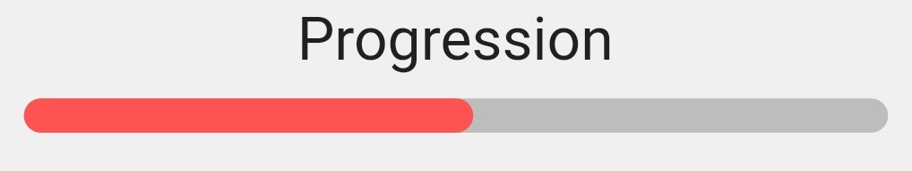 

# Écrans

## Connexion / Inscription
***Connexion*** 
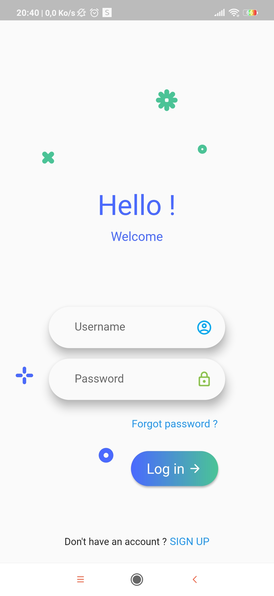
***Inscription*** 
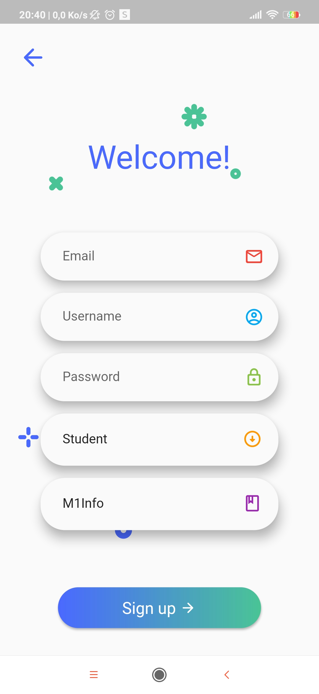

## étudiant
***écran pricipal*** 
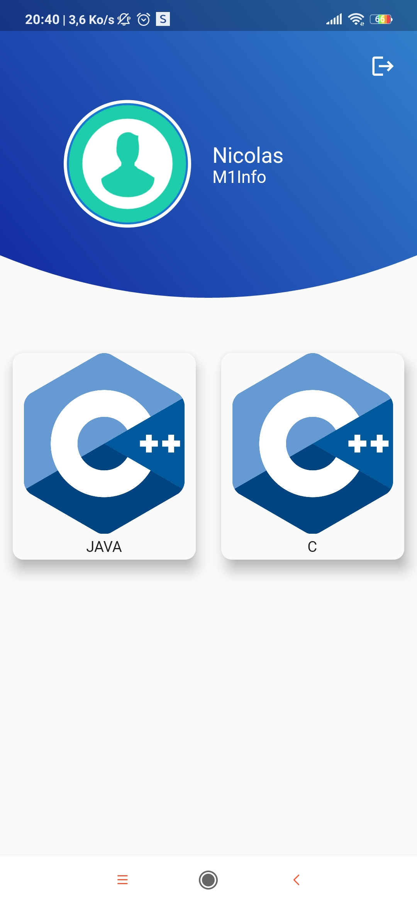
***Affichage des skills d'une section*** 
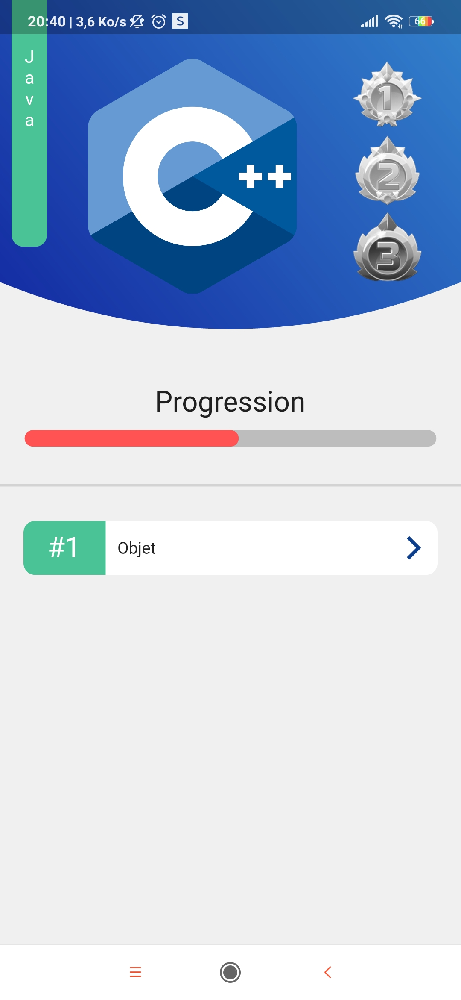
***Affichage d'un skill*** 
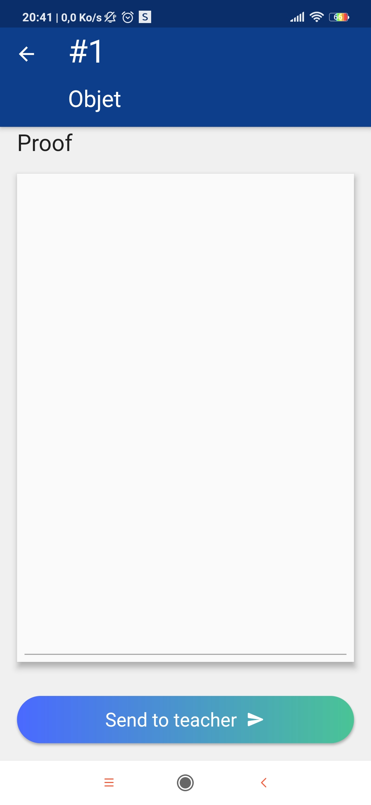

## Professeur
***écran pricipal*** 
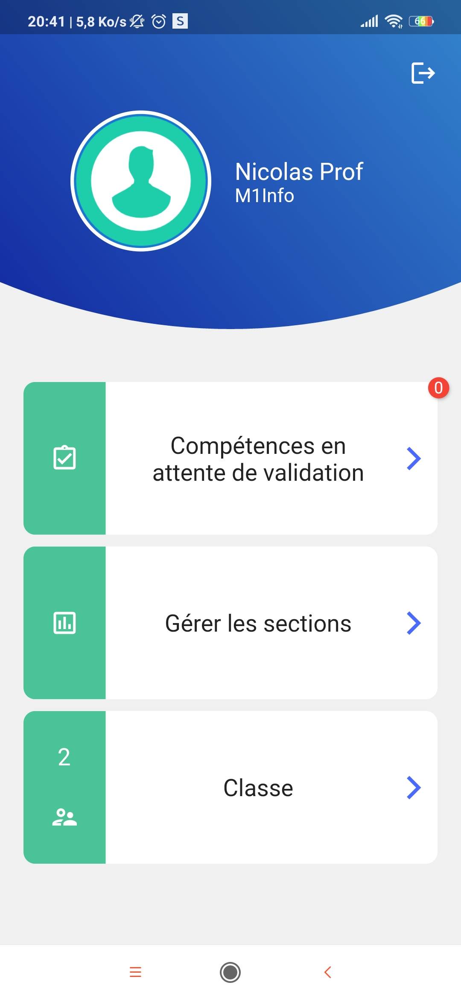
***Compétences à valider*** 
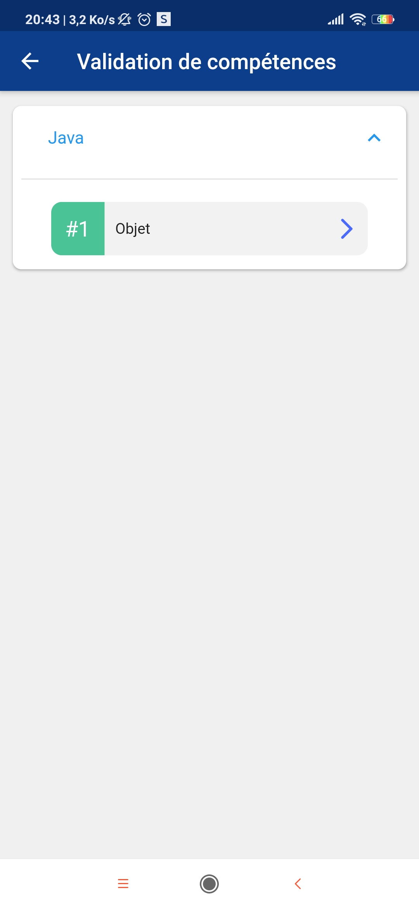
***Validation d'une compétence*** 
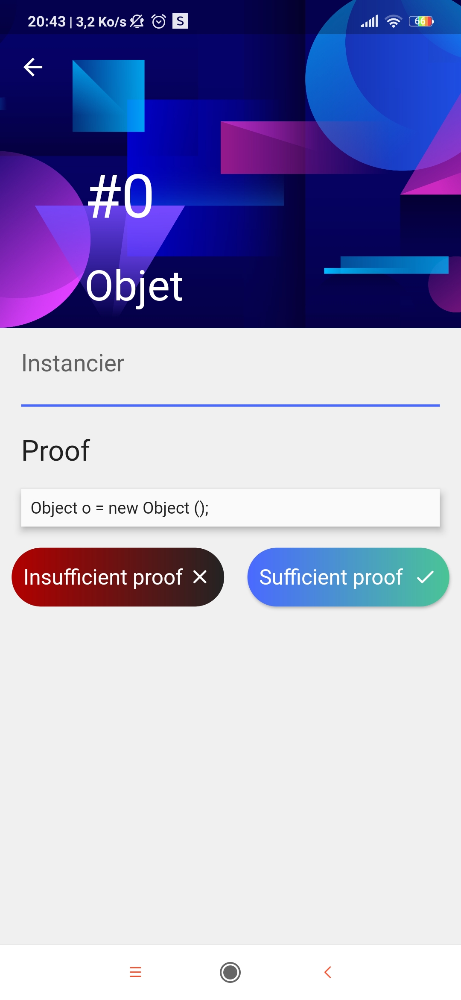
***Gestion des sections*** 
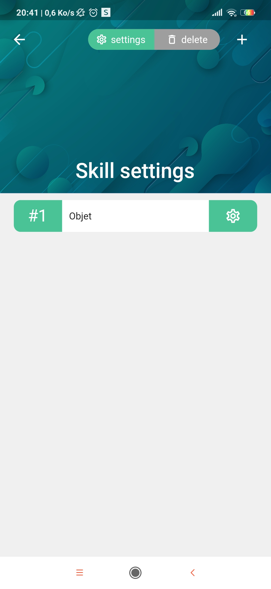
***Gestion des skills d'une section*** 

***Ajout d'une nouvelle section*** 
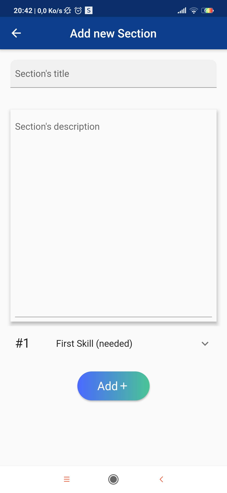
***Ajout d'un nouveau skill*** 
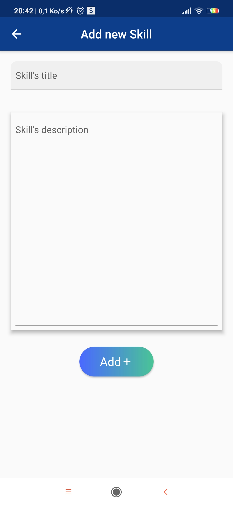
***Gestion de la classe*** 
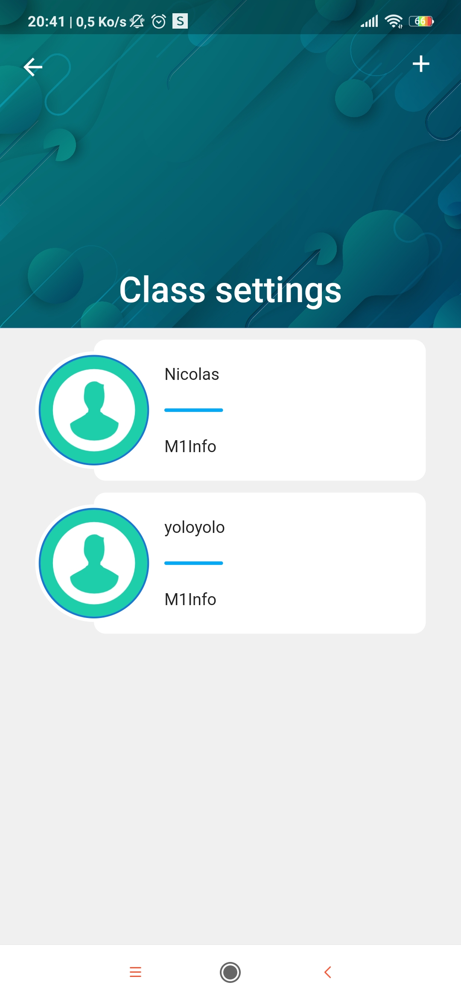